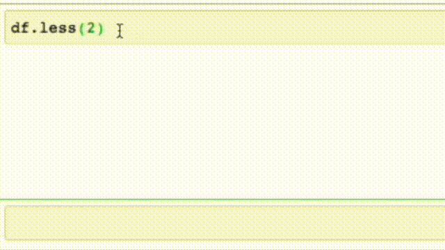

# pdpatch
> New methods for pandas DataFrame and Series.


## Install

`pip install pdpatch`

## How to use

```
from pdpatch.core import *
```

### Utility functions


```
df = dummydf()
df
```


<div>
<style scoped>
    .dataframe tbody tr th:only-of-type {
        vertical-align: middle;
    }

    .dataframe tbody tr th {
        vertical-align: top;
    }

    .dataframe thead th {
        text-align: right;
    }
</style>
<table border="1" class="dataframe">
  <thead>
    <tr style="text-align: right;">
      <th></th>
      <th>col_1</th>
      <th>col_2</th>
    </tr>
  </thead>
  <tbody>
    <tr>
      <th>0</th>
      <td>100</td>
      <td>a</td>
    </tr>
    <tr>
      <th>1</th>
      <td>101</td>
      <td>b</td>
    </tr>
    <tr>
      <th>2</th>
      <td>102</td>
      <td>c</td>
    </tr>
    <tr>
      <th>3</th>
      <td>103</td>
      <td>d</td>
    </tr>
    <tr>
      <th>4</th>
      <td>104</td>
      <td>e</td>
    </tr>
  </tbody>
</table>
</div>


## Interactive Method `.less()`



### Shorter methods


`df.rename(columns={'col_1': 'new_name'})`->`df.renamec({'col_1': 'new_name'})`


```
df.renamec({'col_1': 'new_name'})
```


<div>
<style scoped>
    .dataframe tbody tr th:only-of-type {
        vertical-align: middle;
    }

    .dataframe tbody tr th {
        vertical-align: top;
    }

    .dataframe thead th {
        text-align: right;
    }
</style>
<table border="1" class="dataframe">
  <thead>
    <tr style="text-align: right;">
      <th></th>
      <th>new_name</th>
      <th>col_2</th>
    </tr>
  </thead>
  <tbody>
    <tr>
      <th>0</th>
      <td>100</td>
      <td>a</td>
    </tr>
    <tr>
      <th>1</th>
      <td>101</td>
      <td>b</td>
    </tr>
    <tr>
      <th>2</th>
      <td>102</td>
      <td>c</td>
    </tr>
    <tr>
      <th>3</th>
      <td>103</td>
      <td>d</td>
    </tr>
    <tr>
      <th>4</th>
      <td>104</td>
      <td>e</td>
    </tr>
  </tbody>
</table>
</div>


### Functions as methods


```
df.len()
```


    5


### New methods


```
df.col_1.minmax
```


    (100, 104)


