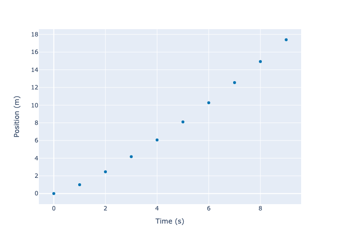

pdpatch
================

<!-- WARNING: THIS FILE WAS AUTOGENERATED! DO NOT EDIT! -->

`pdpatch` adds methods to [pandas](https://pandas.pydata.org/)’
`DataFrame` and `Series` for a faster data science pipeline. It also
defines drop-in replacements for `seaborn` and `plotly.express` that
automatically label axes with nicer titles. We use
[nbdev](https://nbdev.fast.ai/) to build this project.

## Install

`pip install pdpatch`

## How to use

``` python
from pdpatch.all import *
```

### Interactive Method `.less()`


### Automatically Rename snake_case columns in `plotly.express` and `seaborn`

``` python
import pandas as pd
from pdpatch.express import *
df = pd.DataFrame({'time__s__': range(10), 'position__m__': [i**1.3 for i in range(10)], 'speed__m/s__': 10*[1]})
#df = pd.DataFrame({'time__s__': range(10), 'position__m__': range(10)})
px.scatter(df, x='time__s__', y='position__m__').show('png')
```



``` python
from pdpatch.seaborn import sns
sns.scatterplot(data=df, x='time__s__', y='position__m__');
```


### Add Altair-like Operation to plotly Figures

``` python
fig = px.scatter(df,x='time__s__', y='time__s__') | px.scatter(df,x='time__s__', y=['position__m__', 'speed__m/s__'])
fig
```

    Unable to display output for mime type(s): application/vnd.plotly.v1+json

``` python
fig = px.scatter(df,x='time__s__', y='time__s__') / px.scatter(df,x='time__s__', y=['position__m__', 'speed__m/s__'])
fig
```

    Unable to display output for mime type(s): application/vnd.plotly.v1+json

``` python
fig = px.scatter(df,x='time__s__', y='time__s__') | px.scatter(df,x='time__s__', y=['position__m__', 'speed__m/s__'])
fig / fig
```

    Unable to display output for mime type(s): application/vnd.plotly.v1+json

### Shorter methods

`df.rename(columns={'col_1': 'new_name'})`-\>`df.renamec('col_1', 'new_name')`

``` python
df = dummydf()
df.renamec('col_1', 'new_name').to_html()
```

<table border="1" class="dataframe">
<thead>
<tr style="text-align: right;">
<th>
</th>
<th>
new_name
</th>
<th>
col_2
</th>
</tr>
</thead>
<tbody>
<tr>
<th>
0
</th>
<td>
100
</td>
<td>
a
</td>
</tr>
<tr>
<th>
1
</th>
<td>
101
</td>
<td>
b
</td>
</tr>
<tr>
<th>
2
</th>
<td>
102
</td>
<td>
c
</td>
</tr>
<tr>
<th>
3
</th>
<td>
103
</td>
<td>
d
</td>
</tr>
<tr>
<th>
4
</th>
<td>
104
</td>
<td>
e
</td>
</tr>
</tbody>
</table>

### Functions as methods

``` python
df.len()
```

    5

### New methods

``` python
df.col_1.minmax
```

    (100, 104)

### Utility functions

``` python
df = dummydf()
df.to_html()
```

<table border="1" class="dataframe">
<thead>
<tr style="text-align: right;">
<th>
</th>
<th>
col_1
</th>
<th>
col_2
</th>
</tr>
</thead>
<tbody>
<tr>
<th>
0
</th>
<td>
100
</td>
<td>
a
</td>
</tr>
<tr>
<th>
1
</th>
<td>
101
</td>
<td>
b
</td>
</tr>
<tr>
<th>
2
</th>
<td>
102
</td>
<td>
c
</td>
</tr>
<tr>
<th>
3
</th>
<td>
103
</td>
<td>
d
</td>
</tr>
<tr>
<th>
4
</th>
<td>
104
</td>
<td>
e
</td>
</tr>
</tbody>
</table>
